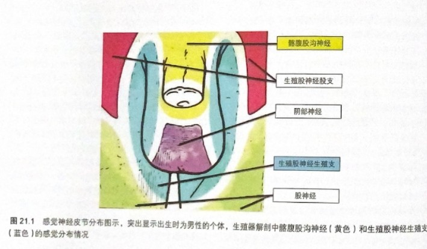
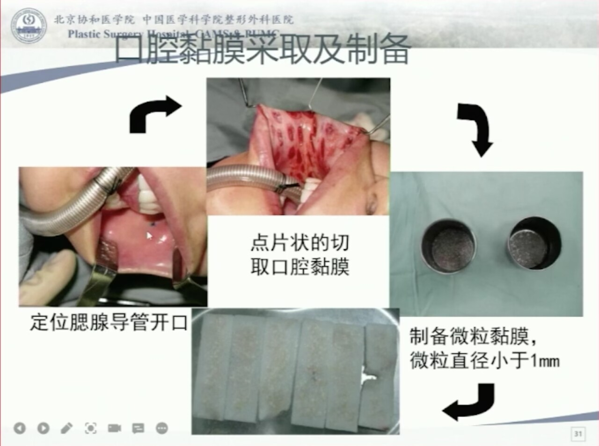



**李峰永**，主任医师，中国医学科学院整形外科医院会阴整形与性别重塑科副主任。[^1]  
擅长女性会阴部的整形与修复重建，以及男转女性别重塑手术。  

**社交媒体：**    
- **小红书：**[八大处李峰永](https://www.xiaohongshu.com/user/profile/60efab7b0000000001001a2c)  

## 口腔黏膜术式

- 价格：10-12万元不等
- 手术时间：约10小时
- 住院时长：18天左右，视情况
- 恢复期漫长，具有相当的痛苦性

该手术由以下几部分组成：  
1. **睾丸切除术：**结扎并切除双侧睾丸
2. **阴茎全切术：**切除阴茎海绵体
3. **阴蒂成形术：**将龟头组织重塑为阴蒂，并妥善固定
4. **尿道移位成形术：**切除多余尿道，重建女性尿道口
5. **阴道再造术：**使用口腔黏膜与阴囊浅筋膜重建女性阴道
6. **会阴体重建术：**重建球海绵体肌、会阴中心腱、尿道阴道括约肌、耻骨直肠肌等一系列肌肉群为女性形态
7. **阴唇成形术：**利用皮瓣组织重塑为大、小阴唇

### 外观部分

#### 外观整形技术

该术式中，绝大部分皮瓣材料均用于外观成形。  

以下图为例演示（图源：《性别确认手术——原则与方法》）：

1. 蓝色区域（生殖股神经生殖支）：水平向后翻折形成大阴唇
2. 黄色区域（髂腹股沟神经）：下拉形成双侧小阴唇与阴道前庭
3. 紫色区域（阴部神经）：垂直后折加固阴道后壁（详见[阴道部分](#阴道部分)章节）

如材料充足，则外观与顺女无异。 


本术式对于脱毛不做强制要求，建议在力所能及的情况下脱毛。


#### 外观效果

术后外观偏纤细，近似天然女性。  
如发生材料不足等情况（常见于阴茎包皮过短），小阴唇难以完全包裹阴道口，后联合处小阴唇会做平滑过渡处理，使得外观不与天然女性过多偏离。  

术后外表面无疤痕，无引流口。  
双侧大阴唇下侧1/3处，靠近内侧会有一道隐蔽缝合口。  
其余位置无缝合痕迹。  


八大处患者隐私保护意识极强，案例不予线上公开。可以在线下面诊时获得。


### 阴道部分

#### 口腔黏膜采取

口腔黏膜于术中即时采取。  
采取方式为在两颊位置，间隔采取成块的黏膜，剪碎后备用。  

#### 阴道壁建立
 
将剪碎的口腔黏膜颗粒，分散的均匀移植到建立好的阴道腔隙内壁。  
以硬质或半硬质材料，包裹于纱布外，填塞进阴道内，以便黏膜分布生长为整体。  

阴道后壁使用部分阴囊皮瓣翻折加固。  
加固在后壁的阴囊皮肤不久后会脱落，保留其下的阴囊浅筋膜（肉膜，Dartos筋膜）。  
此举是为了预防直肠阴道瘘。传统口腔黏膜再造阴道术后，发生此并发症的风险高于其它术式。  

#### 术后预期

- 口腔黏膜与先天的阴道壁同为非角化复层鳞状上皮组织，具有一定的润滑作用。
- 阴囊浅筋膜中具有平滑肌，有一定收缩功能。
- 阴道深度统一为10-11厘米左右，直径3.0-3.5厘米左右。

#### 通模要求

- 模具为术后拆包时可以放入的最大号模具。
- 术后六个月内，24小时佩戴模具。洗澡、如厕时可短暂取出，不得超过15分钟。
- 每天大便后取出清洁模具并冲洗阴道，不得超过15分钟。
- 六个月后按流程逐步脱离模具。

## 零深度术式


缺乏详细资料，待补充。


## SRS术后缺陷的修复


缺乏详细资料，待补充。


[^1]: 不叫“李主任”，叫“峰主任”。
