
数据来自于单名接受手术者，会随实际情况而变动。


**入院挂号+入院检查+备品+住院费用合计108238.26元。**

## 入院当日挂号

李峰永挂号费80元。

## 入院检查

入院检查共计2419.9元。

- 血凝六项
- 激素六项
- 感染八项（住院）
- 血常规（五分类）+血型三项
- 淀粉酶（AMY）测定+肝功组合2+离子组合2+血脂组合2+肾功组合1+心血管组合3
- 尿液检测
- 双侧下肢动静脉彩超检查
- 整形外科术前胸部CT
- 12导联心电图检查



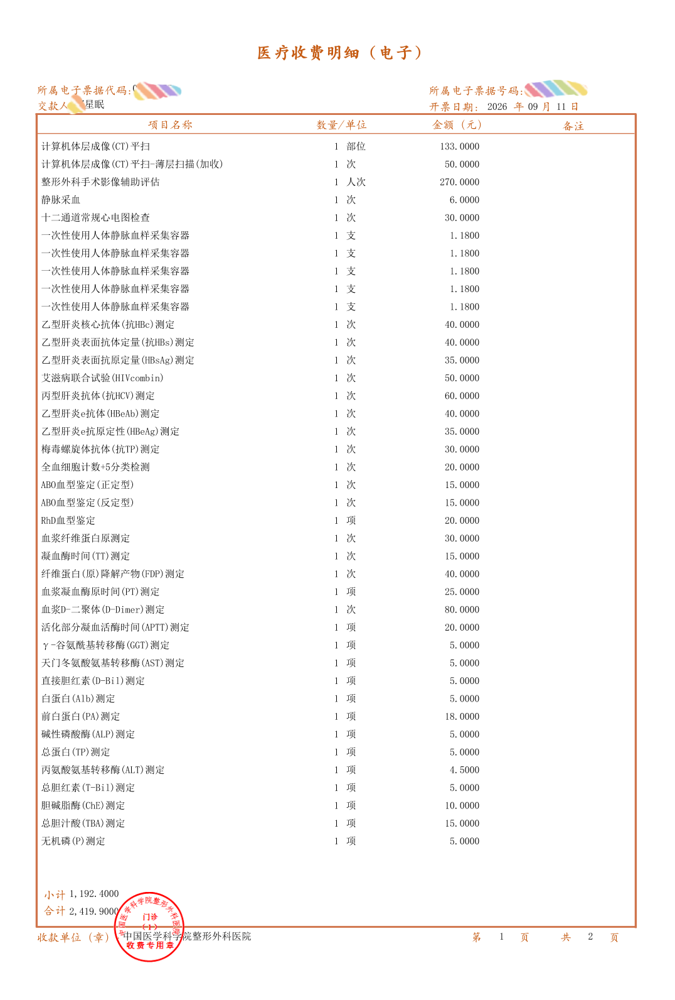

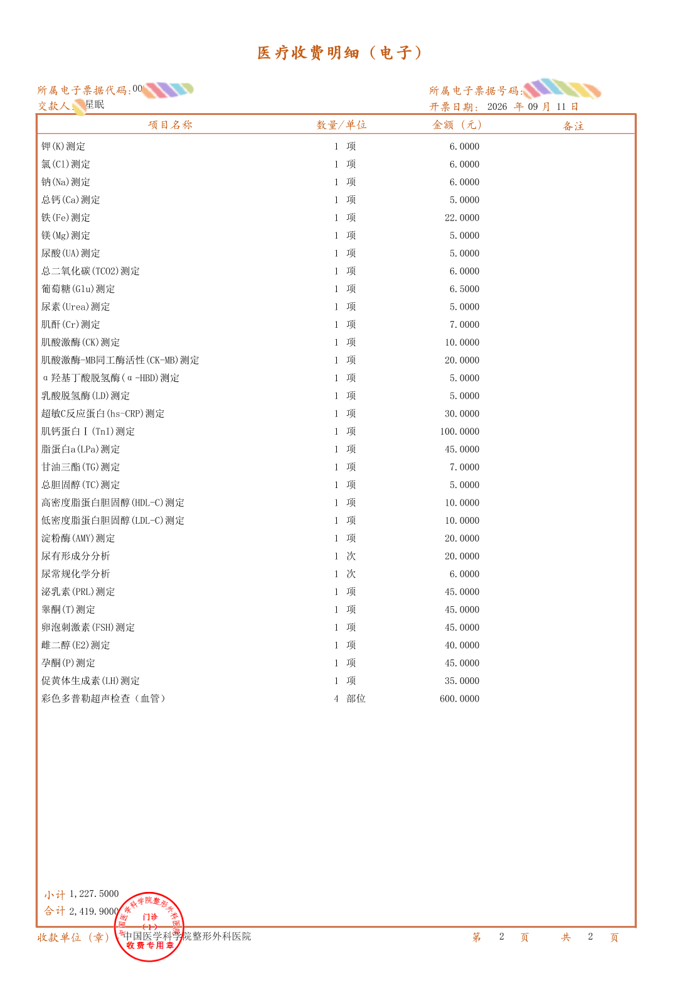



## 入院时要求的备品

备品费共计480元。

- **丁字带**：360元
- **女性便盆+护理垫**：120元

## 住院花费

住院押金12万元整，实际花费105258.36元。



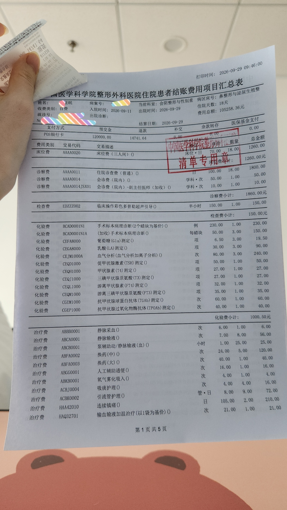

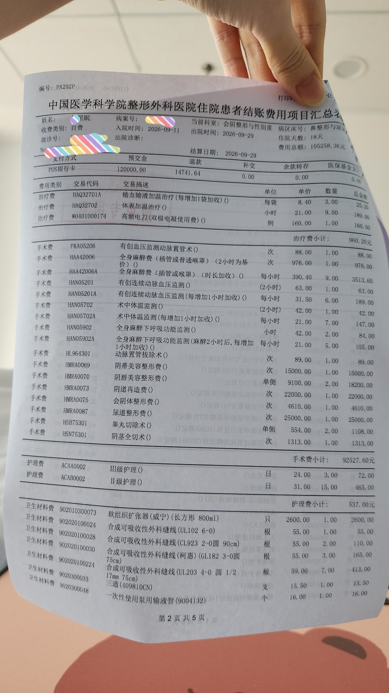

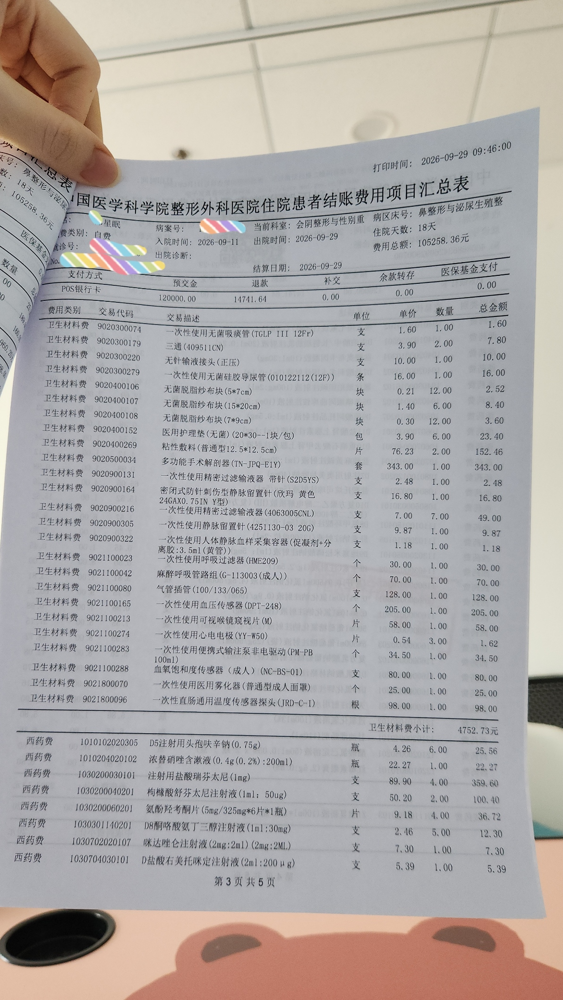

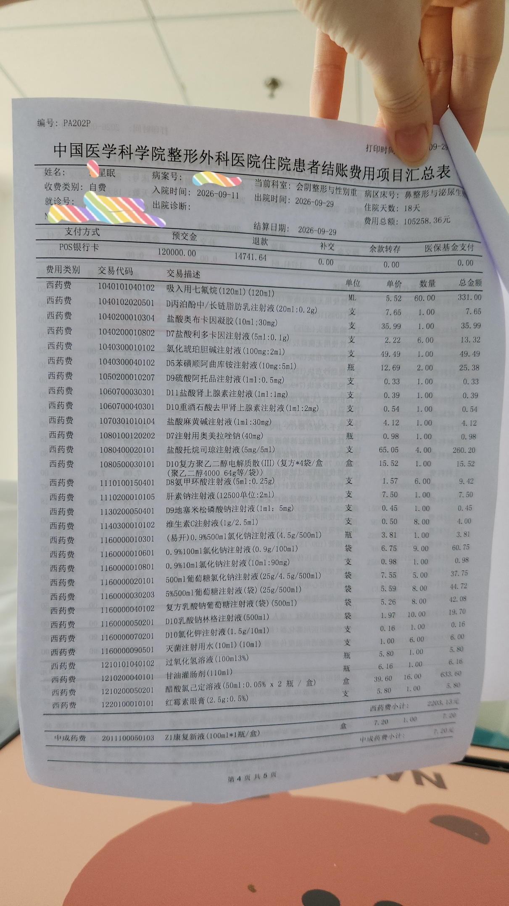





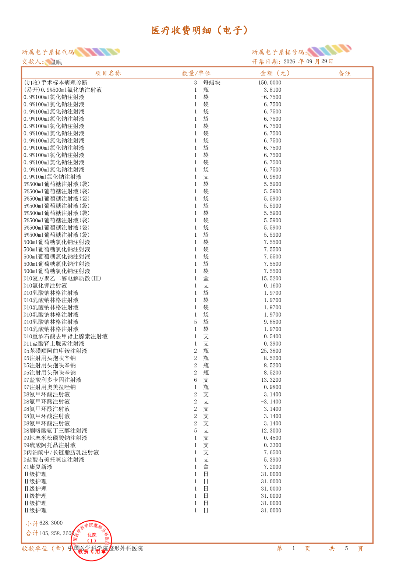

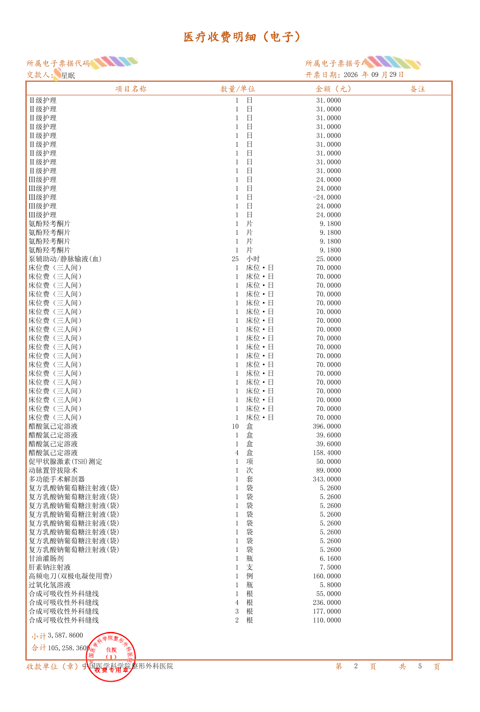

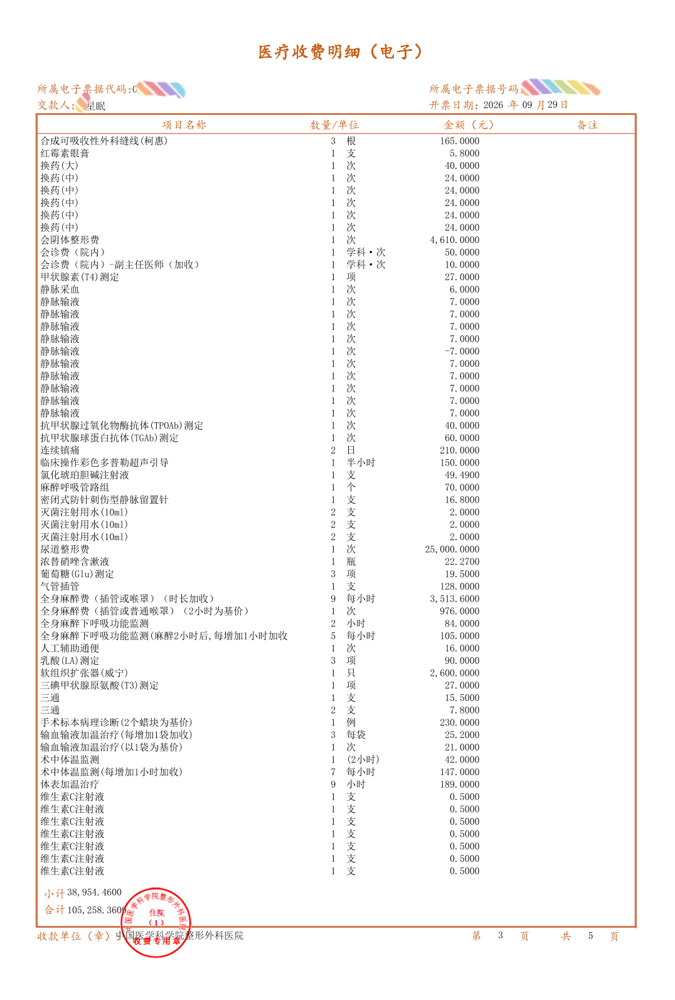

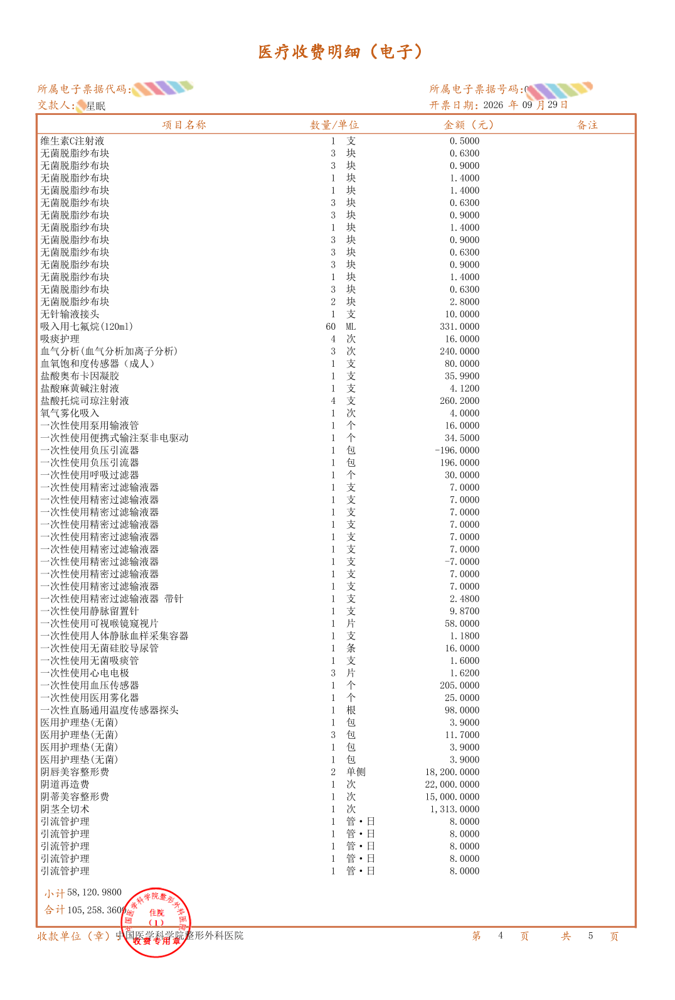

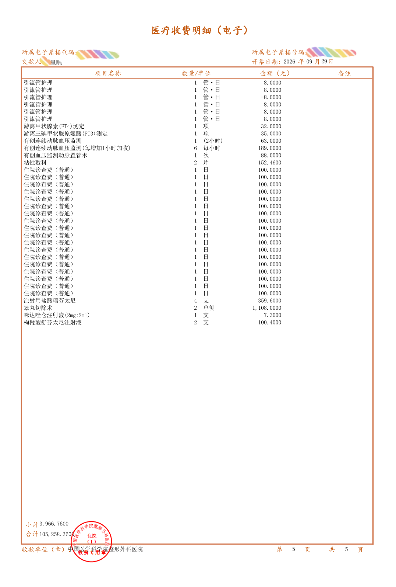


