
内容视角来自于单名接受手术者，会随实际情况而变动。



本章节存在较多人物间互动经历描写，可能会触发焦虑。



本章节中图片存在血液等元素。目前所有图片都默认处于折叠状态，带血图片会有文字标注。


## 前言

整个住院手术过程内容繁杂，事无巨细。遂以时间线的形式记载。\
为补充第一视角细节~~以及活跃气氛~~，时间线中将会存在以[星眠子](https://x.com/hoshinemu123)（twitter: @hoshinemu123）视角添加的小批注，对此部分的疑问可与其本人联系，形式如下：



> 虽然住院时间长而枯燥，但病友说话都好听。\
> 还有护士叫我“宝宝”耶( •̀ ω •́ )y\
> 诶呀我怎么还是喜欢碎碎念……\
> 赞美峰主任！



## Day-3 鸡飞狗跳的入院

- 早晨8:30**空腹**到达住院楼**北楼四楼西侧鼻整形与泌尿生殖病区**，微信联系科室秘书（简称“科秘”），领取峰主任实体加号条。行李可以暂时放在病区里面门口（丢失自负）。
- 持加号条，前往**门诊一楼大厅扶梯前右侧**，门诊挂号缴费窗口挂李峰永的号。当日峰主任并不出诊，所以你将是当日第一号。挂号费80元。
- 挂号后微信通知科秘，等待其开具入院检查以及申请住院。
- 在**门诊挂号缴费窗口交检查费**，共2419.9元。获得超长缴费条x1。



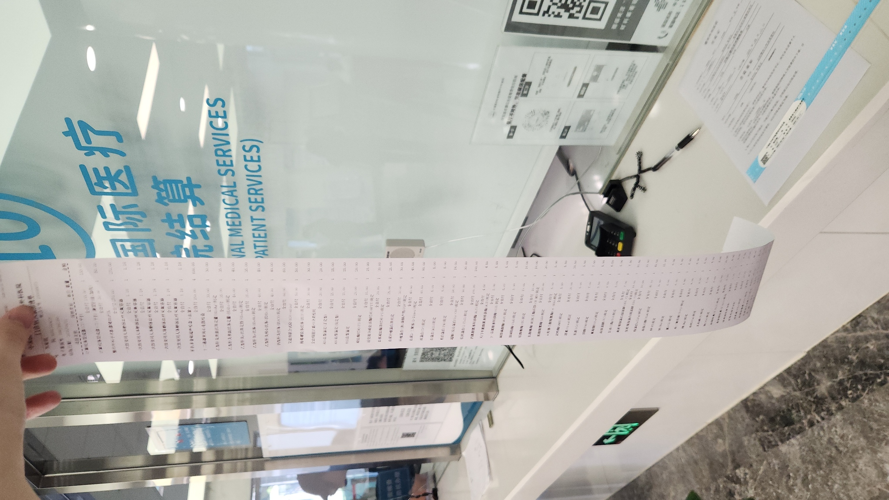



- 门诊窗口往里走，在尽头取号机上取号，等待住院服务叫号。
- 在**住院窗口办理住院**，缴纳住院押金12万元整。住院押金可以分笔缴纳，支持信用卡。获得住院单与腕带。以及住院押金收据（**务必妥善保管**）。需要带身份证。



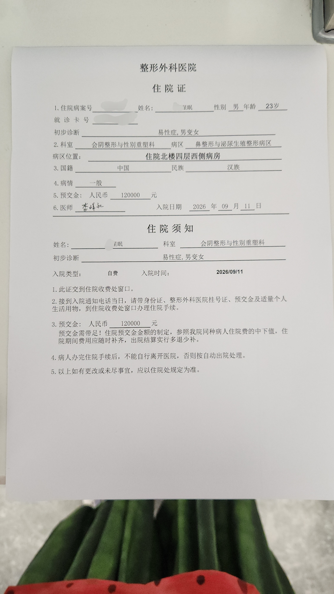

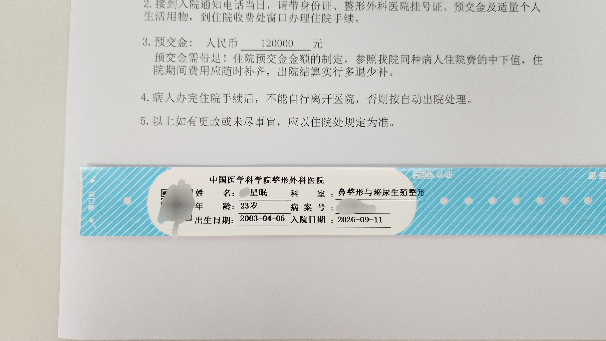



- **门诊一楼大厅往前走**，左手边厕所门口尿管机取验尿试管，旁边桌子上取尿杯（无限量供应）。验尿后标本也放在这个桌子上试管架里。
- **门诊一楼大厅往前走**，越过取尿管的位置，再往前左手边检验科采血室，验血。五管血，蓝紫黄黄黄管。
- **门诊大厅扶梯下去负一楼**，左手边做心电图、下肢血管彩超和胸部CT。心电图不用登记，直接进诊室做。CT和彩超要先登记，等待时间很短。
- 先偷偷出去吃个午饭，然后尽快去病区报到。报到后就不可以擅自离开病区了。
- 到达病区后，登记基本信息，安装腕带，量体重血压，分配床位。（病房分为1-4人间。SRS是这个科室最大的手术，会尽量给你单独安排一个空病房。）最后会给你一些小甜水小咸水。
- 趁早去购买女式便盆、护理垫和丁字带（带入手术室，加压包扎）。
- 丁字带先去医院**东大门左边那一排平房**，往里走敷料室，量体后开票。
- 拿着丁字带的票，去**门诊地下一楼**，下扶梯右手边交费，360元。同时在此处购买便盆和护理垫（可以提前自己多买些），共120元。
- 拿着缴费收据，去刚才的敷料室领取丁字带。丁字带**一定不要拆封**，直接带进手术室。
- 返回病区，病区护士站有订餐二维码。医院订餐效果评价：“能吃”。
- 护士站有租陪护床电话、微信，30元一天。租被子(1.5\*2米）+枕头，25元/夜。租一套（床、被子和枕头）55元/夜。押金200元。退床退押金。若需被枕提前说明，陪护床仅限在病房内使用。下午5:30–7点到住院楼B1层走廊中间职工餐厅对面取床并交费。~~家属完全可以偷着住空病床，护士睁一只眼闭一只眼。~~
- 病区有驻场的陪护老大姐，可以雇。爱八卦，略有点市井气息。单人独享服务240/天，双人共享220/天，三人共享200/天。
- 护士带你去换药室备皮（刮毛）。
- 麻醉医生前来访视，和麻醉医生沟通你的用药，以及其它情况。问你是否需要止痛泵时，请量力而行，止痛泵不贵。~~（为什么 麻醉医生大多是小个子年轻温柔女生啊）~~
- 如果有其它内科基础病（如甲减），需要到内科会诊。
- 内科在内科楼，是一整个小科室。二楼医生办公室找内科主任会诊，内科主任友跨，将会称赞你的勇气。
- 回到病房补充上内科会诊需要的检查，验血护士会到床边抽。
- 墙上插座在床头柜后面。氧气管路上的插座不能插。（插满之后，护士尖叫：你是来炸医院的吗！！！）
- 第一天就这样结束了，展示下病房环境：



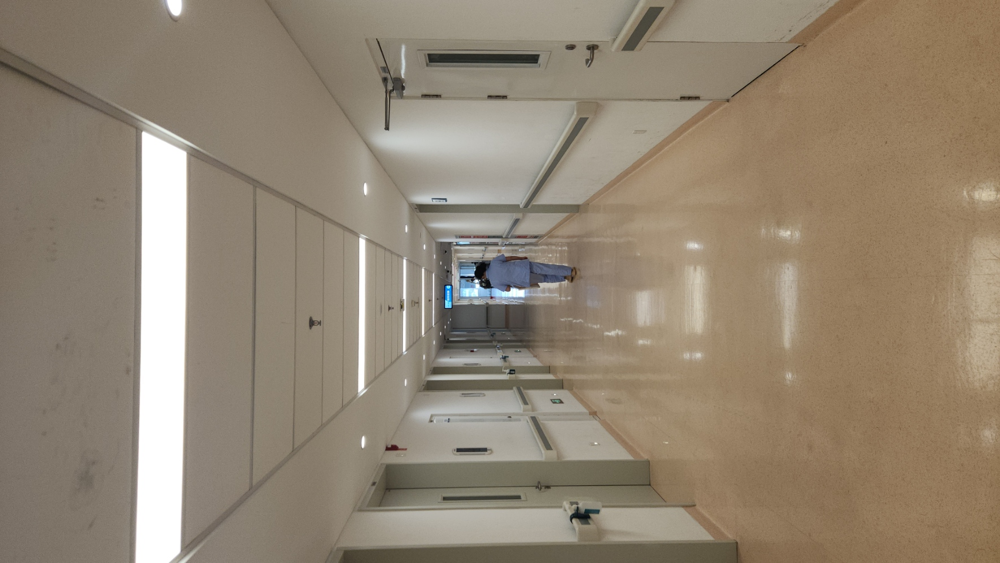

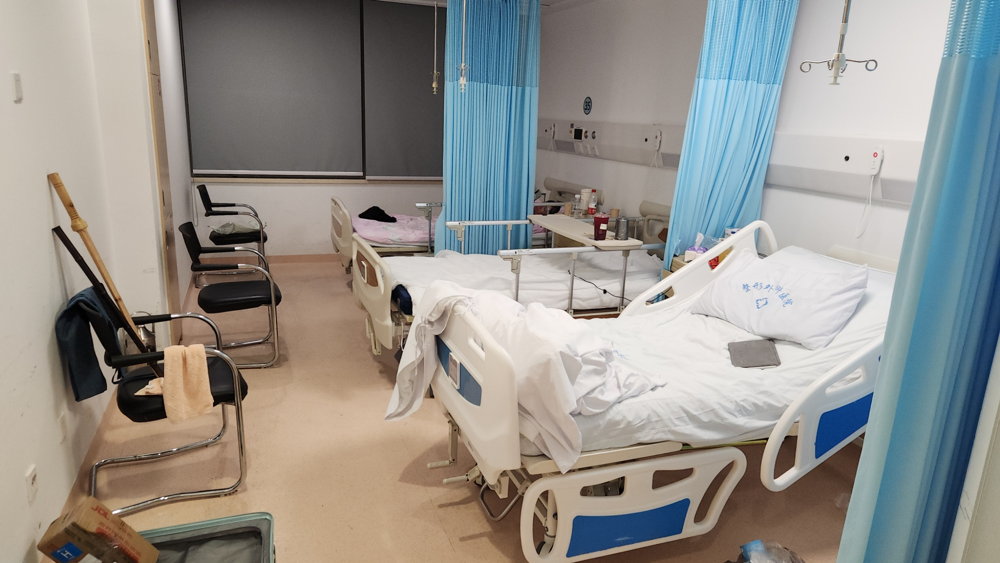

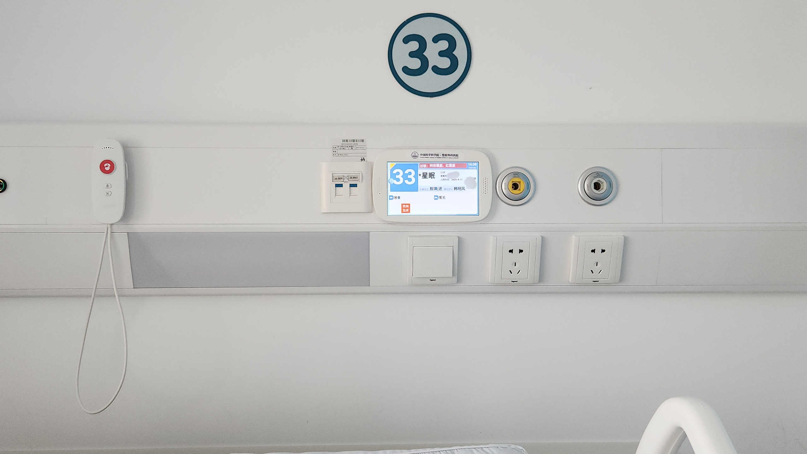

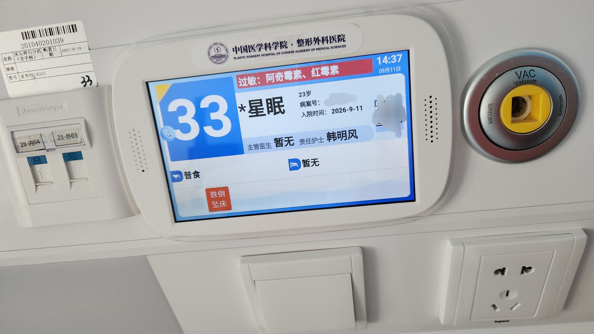

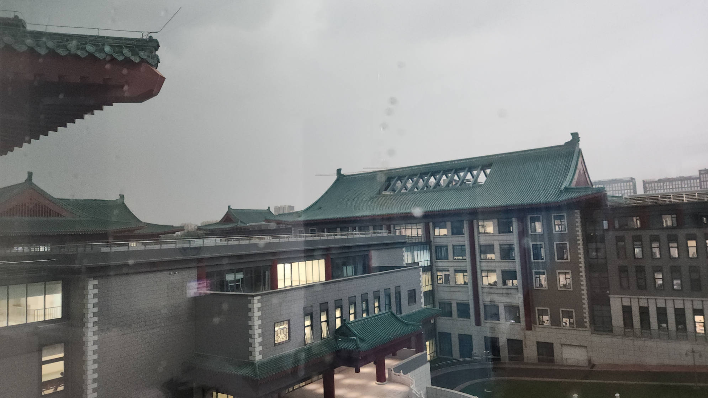

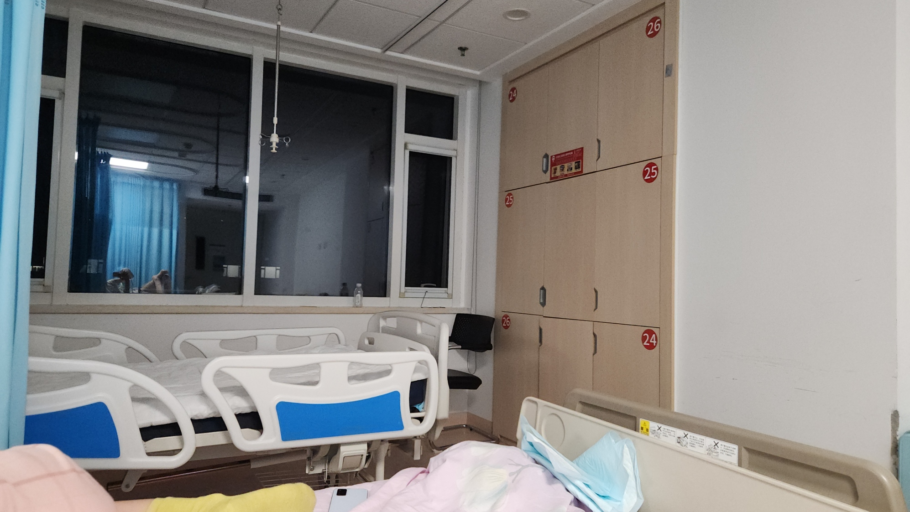





> 友跨医院！友跨医院！\
> 医护人员态度超温柔。
>
> 病区里不会用文字标识性别，看着比较舒服。
>
> 另：病房管理没太多杂事，不会对病人和家属进行“军训”。



## Day-2 喝蟑螂汁儿

- 今日吃**半流食**。
- 每隔一段时间用康复新液漱口，至少五次。



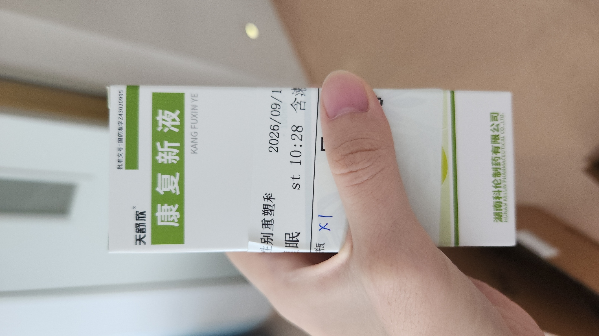



- 峰主任前来病房谈话，讲一讲手术方式、风险。会问你要不要深度。



> 有点儿甜，但味儿真的很怪。
>
> 另：当天满脑子都是“有‘福’了。”



## Day-1 我真的喝不下了

- 当天喝**流食**，午餐是**最后一顿**。
- 当天交替用康复新液与浓替硝唑含漱液反复漱口。**替硝唑别忘了稀释。**



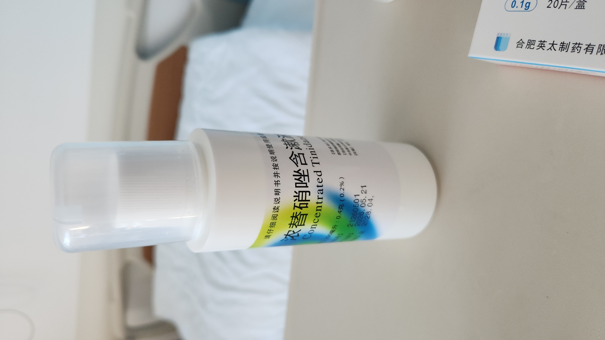



- 14:00后，将每小袋复方聚乙二醇电解质散兑入1升温水中，**两小时内喝完两升**。这将会是整个住院过程中前三大的折磨。满嘴线切割冷却液味。拉出来容易，喝进去难。**不能兑饮料。**



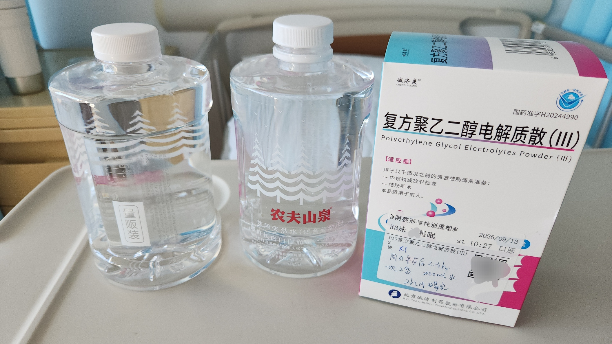



- 管床医生带你去谈话室，进行术前谈话与签字。前往换药室测量手术材料尺寸。管床医生很可能是前来进修的医生，并不清楚手术具体内容。手术内容以峰主任为准。
- 护士叫你到护士站量体重时候，别忘了减去你喝下去的重量。
- 睡觉前会有护士来灌肠，确认拉出来的是略带黄色的清水。否则就继续喝吧！！！



> 怎么这几天喝的东西一个比一个味儿怪啊。╮(╯▽╰)╭
>
> 那个聚乙二醇真的是，喝的泪流满面，呕——\
> 我胃容量小，一边喝一边等胃清空，两小时根本喝不完，最后医生也无奈了。\
> 最后喝进去两升半，呕出来半升，均匀涂布在病房地面上。
>
> 看说明书上的“不良反应：呕吐”，真是气笑了。
>
> 小提示：喝一口聚乙二醇，立刻拿饮料漱漱口吐出来，再喝下一口。会对这个过程有所帮助。
>
> 另外，测材料尺寸，“你以前就这么小吗？”是什么意思啊喂！



## Day+0 睡一天

- 0点开始，**任何东西都不能进嘴**（从鼻孔也不行）。必须服用的药物，可以用**极少的水**送服。
- 早晨起来去把肚里剩的水拉干净。
- 换衣服，身上**什么也不穿**，只穿病号服。
- 7:55所有当天手术的人到病区门口等待，**拿好丁字带**，手术室会派人带你们去二楼手术室。
- 在患者通道换鞋，进入患者等待室。稍等片刻后，麻醉医生会叫你名字，带你进入手术间。
- 核对患者信息后，脱光衣服，躺上手术台，摆体位。峰主任会前来查看体位是否合适。
- 麻醉医生进行静脉通路建立（胳膊和腿上扎不了，就要扎脖子深静脉了哦），再次核对患者信息，拿来氧气面罩让你先吸点氧。然后推药，“睡一觉就结束了哦！”~~（为什么 麻醉医生大多是小个子年轻温柔女生啊）~~
- 术中会气管插管，动脉穿刺置管。但这些都会在你苏醒前撤掉，麻醉医生技术高超，你不会有任何感觉的。苏醒后呕吐这些情况也会得到妥善抑制，不过还是看个人体质。
- 不出意外的情况下，术中无需输血。全程没有涉及到大血管的操作。
- 19:00在苏醒室醒来，身上全部肌肉发抖是正常的麻醉反应。会有麻醉医生/护士推你回病房。身上带着麻醉时穿刺的静脉留置针和上面连接的止痛泵，以及术中放置的导尿管（外面沾满鲜血）。我们的术式是没有引流管的！



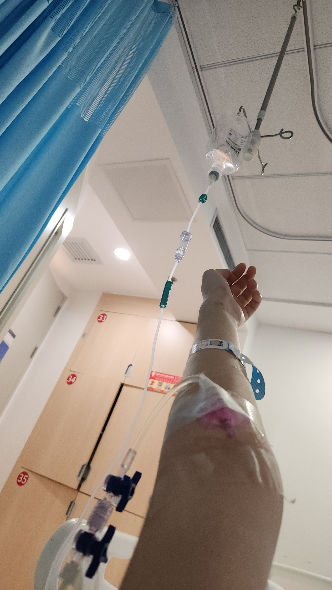



- 回到病房，过床后，可能会给你留下一张手术室的中单（沾着你的血）。未来几天你将一直光着身子，这张中单将是你的宝藏被单，好盖还不怕脏。



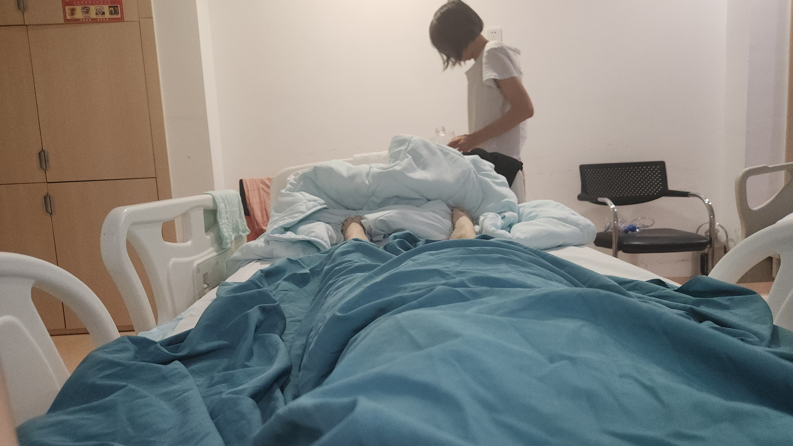



- 护士们会喊；“XX床回来了！”然后会拿着超大袋的液体给你输一宿，补液以及防止你饿。
- 今晚不会很疼，愉快的睡吧。实在疼的话管护士要羟考酮片吃，即可获得两小时完全无痛时间。还可以自备双氯芬酸钠胶囊（商品名：戴芬）。



> 因为是大手术，麻醉前麻醉科主任还来看了我一趟。\
> 获得了一次超长时间优质睡眠，体感上只是小睡了10分钟。\
> 一周后胳膊青了，才发觉术中穿刺了动脉。\
> 麻醉醒来恶心呕吐是什么？不存在的。



## Day+1 怎么不早说有止痛药啊

- 从昨晚开始输液，一直到今晚。
- **禁食**，可以喝点红糖水，但不喝也不会饿。
- 今天的首要任务是，用舌头慢慢把嘴里两边填充的止血纱布舔出来。几乎不疼。然后**千万不要拿镜子看嘴里**，否则你该谢谢我的。



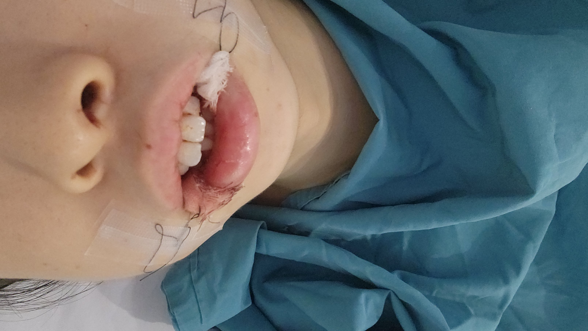



- 下午峰主任会来解开丁字带，更换里面的纱布敷料。在这之后**享受疼痛吧！**
- 可以吃双氯芬酸钠止痛，也可以按止痛泵。实在忍不住可以每8小时让护士找医生，开一片羟考酮，止痛效果极佳。



> 换敷料后，护士查房，见我双目圆瞪，手攥病床扶手，大汗淋漓。\
> 护士：“宝贝你疼啊？”\
> 我：“……是……”（咬牙）\
> 护士：“你止痛泵呢？”\
> 我：“之前不太疼，没按。现在疼起来，忘按了。”\
> 护士：“你用止疼药了吗？”\
> 我：“啥止疼药？！”（有这好东西怎么不早说）\
> 护士：👍



## Day+2 今日无事

- 今日无事，输液从早到晚。**禁食。**
- 峰主任还会来给你换一次敷料。
- 自己买点头孢吃。



> 我和我妈说笑话，两人遂大笑。\
> 我：你别笑了，笑的我逼疼。\
> 我妈：？下次说话能不能不要这么直白？\
> 我：都是被推友带坏了。



## Day+3 阴道内冲洗

- 今日输液仍然从早到晚。**禁食。**
- 峰主任会来换敷料，这中间会拿大号注射器扎进你阴道填充的纱布块里，向里面注射消毒液冲洗。



> 昨日，小梅：
>
> > 传说在天地初开之时，先天元炁分为了浊气和清气，清气上浮变为灵珠，也就是卵巢，浊气下沉变为魔丸，也就是睾丸，魔丸灵珠本为同源之物，这也是为什么一个在上一个在下……
>
> 我：
>
> > 昨天还在这笑，今天看小说突然醒悟了：\
> > 我在这禁食，不吃东西只打点滴（丹药：辟谷丹）也不饿，这不就是辟谷嘛！\
> > 已经先人一步踏上修行路了。\
> > 目前筑基了。



## Day+4 该感冒了

- 今日输液依旧从早到晚。**禁食。** 阴道内冲洗依旧。
- 今天**感冒发烧是正常的**，毕竟清肠后又在手术室里面冻那么久，麻醉，还失血。



> 护士量完体温看我：“宝宝你居然没有感冒！”\
> 然后又看看我：“诶呀你脸色这么好！”\
>
> 另：头发可以编成辫子，否则躺几天之后将会获得一脑袋死结。



## Day+5 今日亦无事

- 今日输液依旧从早到晚。**禁食。** 阴道内冲洗依旧。
- 如果身子痒，可以抹点爽身粉。



> 我：买点爽身粉吧，总比玉米淀粉好。\
> （买来强生爽身粉后）\
> 成分表：99%玉米淀粉。



## Day+6 结束一段苦难

- 今日可以试着起身，在床上跪坐一会儿。
- 今日输液大半天。阴道内冲洗依旧。
- 可以吃**半流食**了。



> 我：（扑腾着起身）\
> 我妈：你你你你你你你……躺好了，别着急！



## Day+7 起来走走

- 今日只有3袋液体，一上午输完。
- 阴道内冲洗依旧。
- 今日可以**吃点清淡的食物**了。
- 有可能会给你换病房，不再让你独自一人。给你安排进的病房会是**女性病房**，不按照入院时登记的性别。
- 把尿袋挂在输液架上，推着输液架在病区里走走。



> 我：（推着输液架在病区里到处溜达，还拿木剑活动了上肢）\
> （见峰主任在护士站坐着）\
> 我：（拎着剑在峰主任眼前晃悠）\
> 峰主任：（瞥）（明天见吧！！！）



## Day+8 拆包，迎接痛苦吧

- 从今日起**不再输液**。
- **开始尿管夹闭训练。**
- 早晨峰主任会来叫你去换药室“大换药”。
- 在换药室，拆包。剪开固定阴道填充物的缝线，用卵圆钳逐块抽出阴道内固定的纱布块。放入鸭嘴钳，撑开检查阴道内情况。然后用消毒液冲洗。
- 冲洗后放入峰主任提供（借）的硬质医用模具。整体为圆柱形塑料壳，上表面有一圆柱槽防止压迫尿道。模具尺寸是固定的，3.0或3.5厘米直径，约10厘米长。随后垫上20x30纱布垫，用塑身衣固定。**（应保持模具完全处于体内，图中为错误示范）**



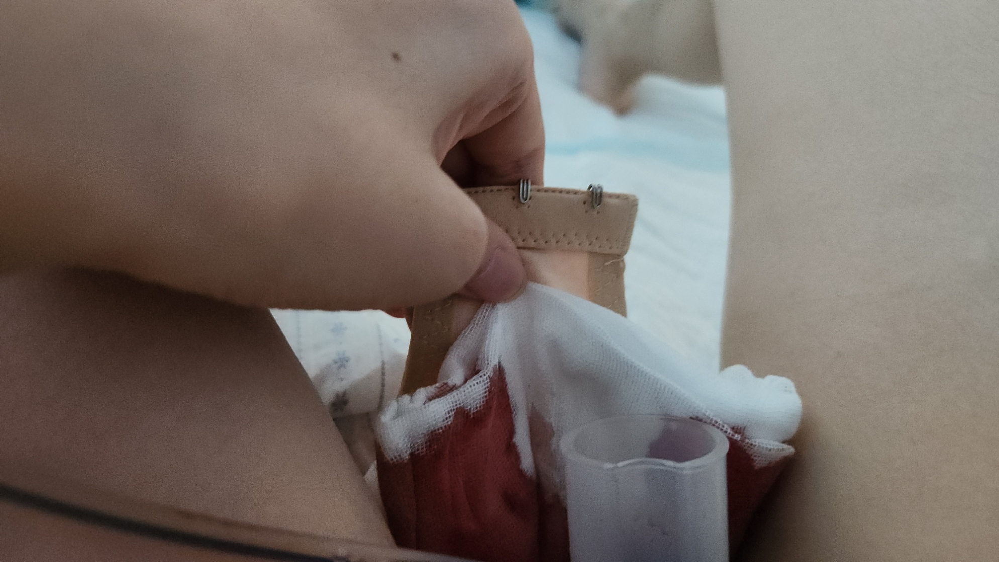

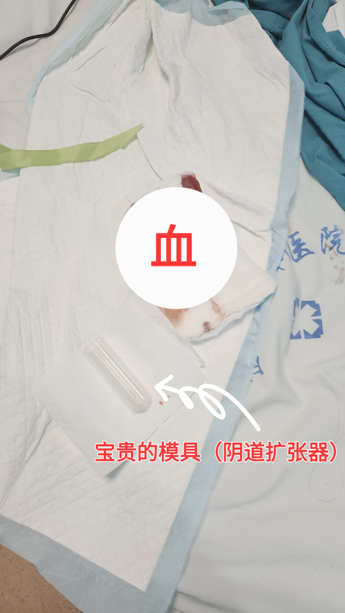



- 模具价格很贵，数量稀缺。**上厕所时摁住模具，千万不要喷进厕所。**（你猜为什么数量稀缺）
- 如果戴模具无法正常大便，可以找医生短暂取出模具（**不超过15分钟**），排便后放回。
- **大便后卫生纸务必从前往后擦。**
- 经常左右调整尿管位置，防止尿管长期压迫某一侧阴唇。
- 今天可以摸到自己的大阴唇了，会很好摸，**但不要经常摸！**
- **今天会很疼！！！比之前所有的都疼！！！流很多血！！！**



> 峰主任：这是我最后剩的一个模具了。你上厕所给我拿手顶住了嗷，别给我喷厕所里。喷厕所里就再也没有了嗷，所有人都没有了。
>
> 另：大阴唇温温软软的，真的很好摸。



## Day+9 去尿尿

- 早晨峰主任叫你带好自己的模具（假牛子）和避孕套，去换药室换模具。
- 在换药室拔出尿管。
- 峰主任将假牛子头剪掉，留下11厘米的长度，将头部修圆滑，作为你以后的模具。
- ~~假牛子~~模具应在使用醋酸氯己定冲洗阴道后，套上避孕套，并涂抹碘伏后使用。
- 尝试尿尿，实在尿不出来**可以稍微拔出模具**。(浴血奋战)
- **尿在模具上无需另作处理，尿液是无菌的。**



> 峰主任：（看）“你这塑身衣不行啊，模具都露出来这么多，阴道都变短了一点。”\
> 峰主任：（拿着假牛子比了比）“嘶——3.5的好像放不进去啊。”\
> 峰主任：“算了我模具再借你用一天，明天你带3.0的来。”\
> 峰主任：“一定一定要按住了，不要把模具喷进厕所里。这真是我最后一个了！”



## Day+10 学习自己放模具

- 早晨峰主任会带你去换药室，教你自己拿出模具清洁，然后放回去。（依旧浴血奋战）
- 模具在身体里放一天之后，会变成弯的。~~（你可以去找PAI的朋友，比赛谁先把模具通弯）~~



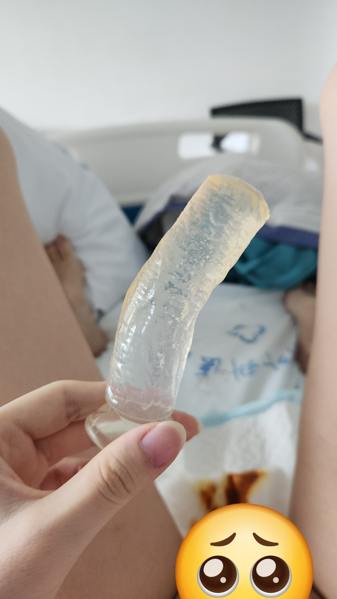





> 我：我昨天尿不出来啊。使劲挤的话能喷出来一点，放松尿不出来啊。\
> 峰主任：你把模具放里面压着尿道，肯定尿不出来啊！
>
> 另：尿液流过手上的感觉真的很舒服。



## Day+11 自己放模具

- 今日大便后，自己与家属在护士带领下，独自前往换药室，清洁模具。
- 备品：护理垫、避孕套、醋酸氯己定。换药室提供：碘伏溶液、棉签、20x30纱布垫。
- 铺好护理垫，解开塑身衣，放下旧棉垫后，将塑身衣下端提到腰部。
- 取出模具后，使用一支醋酸氯己定冲洗阴道内（每盒两支）。沿阴道方向插入，试探转弯，到底后捏住球囊冲洗。**不松手**，将其拔出后，再次进行上述操作。**一定不要在球嘴插入阴道时松手！！！**
- 使用另一支醋酸氯己定冲洗会阴外表面。
- 使用碘伏清洁阴唇，重点清理间沟，**要扒开清理**。
- 更换模具上避孕套，涂抹碘伏后，缓慢的**完全**送入体内。**底座应与阴唇紧贴。**
- 对折20x30棉垫为20x15厘米，垫在模具外。穿好塑身衣，裆部挂钩应**挂在最紧位置**。



> 戴这个水晶硅胶模具的感觉真的非常非常的奇特，非常有意思。\
> 坐着和走路都很有意思。\
> 莫名有些舒服。\
> 膀胱里有尿时候起身，就有一种莫名的愉悦感。\
> 诶呀真不是我色。
>
> 另：当日中秋节，我在医院主持了——拜月仪式。\
> 也是当上“大祭司”（正确说法是主祭）了！



## Day+12 还得再适应适应

- 今日无事。大便后和护士打招呼，前往换药室自行更换（清理）模具。



> 智斗住院总医师。\
> 有个住院总医师喜欢赶人出院，把床位空出来。
>
> 第一回合：\
> 住总：你好的差不多就能出院了。\
> 我：那我拆线呢？\
> 住总：出院过几天再拆线也行。\
> 我：（你听听这是人话吗？）我是外地来的，挺远的，我们当地医院能拆吗？
> 住总：应该……能吧。（迟疑）\
> 我：（嗤）\
> 住总：（转身走了）
>
> 第二回合：\
> 住总：你现在大小便都没啥问题了吧。\
> 我：大便挺好的，小便这不是昨晚没尿出来嘛。\
> 住总：现在尿出来了吗？\
> 我：尿出来了，但还得再观察观察。
>
> 第三回合：\
> 住总：你现在通模都正常是吧。\
> 我：在学习自己通呢，但还得再适应适应。



## Day+13 病友说话也好听

- 今日亦无事。大便后和护士打招呼，前往换药室自行更换（清理）模具。
- 批上随机位置，随机时间，会一抽一抽的突然疼一下。



> 和病友小姐姐甲，病友小姐姐乙与护士姐姐（会叫我“宝宝”的那位）聊天。
> 病友甲：我看看你哪年生的。（看腕带）\
> 病友甲：诶，你的腕带怎么是蓝色的？\
> 病友乙：（前几天就知道我做性别重置）原来你入院时候登记的性别是男性的啊。
> 病友甲：那你来做的是——\
> 我：性别重置。\
> 病友乙：她现在是女生！\
> 病友甲：诶！那你以前是男生吗？\
> 护士姐姐：不是的，她生来就是女生，只是不幸……\
> 病友甲：啊啊啊我懂这个，就是生错了身体的性别！\
> 护士姐姐：像她们这种人，很多都比生下来就是女生的女生还女。心思特别细腻，温柔，而且才华横溢。我见到好多，都是在某个领域特别特别擅长的。
> 病友甲：完全看不出来啊！你说话声音好温柔啊。你会用激素吗？\
> 我：一直都在用的。\
> 病友甲：你长得真的好漂亮啊。眼睛真漂亮。\
> 我：哈哈哈，我戴了美瞳。\
> 病友甲：不是不是，你眼睛的形状就很漂亮。诶呀你这冷白皮我梦寐以求的，你脸好小。
> 护士姐姐：骨相美啊。
>
> 另：找到了新乐趣——躺在医院床上看墙内人妖/反跨视频。
>
> 另：护士姐姐来查房，说我的精神状态是她见过这么多人中最好的。\
> 然后我发的手术记录推文，被以前来做手术的病友，转发了给她。\
> 传了一圈了哈哈哈。



## Day+14 拆线

- 早晨会有医生找你去换药室拆线。
- 要拆的位置是两侧大阴唇下方的丝线，以及阴蒂附近。
- 间沟中的可吸收缝线可以挑开，等待自行排出。
- 小疼，但拆线之后的牵拉感会少很多。
- 拆线时峰主任会过来看一下恢复情况。



> 感觉保留的非常好，偶尔碰到阴蒂，心肝儿都在颤。\
> 酥酥麻麻酸酸软软。\
> 回病房后哭了很久，不知道是委屈还是喜悦。\
> “我的灵魂颠沛流离了二十年，终于回到自己的身体里了……”
>
> 另：\
> 拆线大夫：你还说明天再拆，你这线都长到肉里了啊！



## Day+15 出院

- 早晨管床医生来看你，确认出院的情况。
- 让她开出院诊断时候**别忘了加性别鉴定**。另外可以让她加入“适宜乘坐交通工具”的内容，以便申请机场/航司轮椅服务。
- 拿到将你称作“同志”的出院通知单。



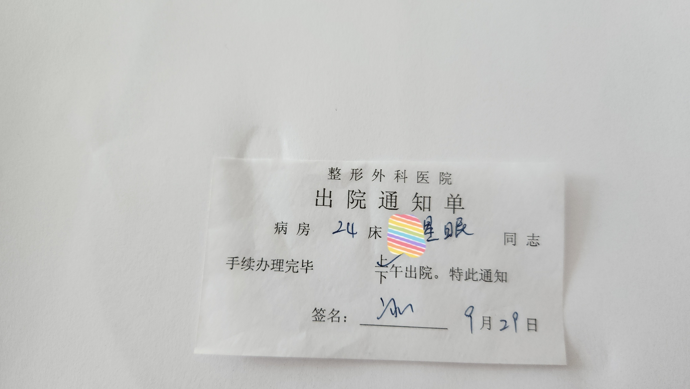



- 拿到诊断证明，**检查其上内容。** 这将会是你此生得到的第一份，带有你正确生理性别的证明文件。



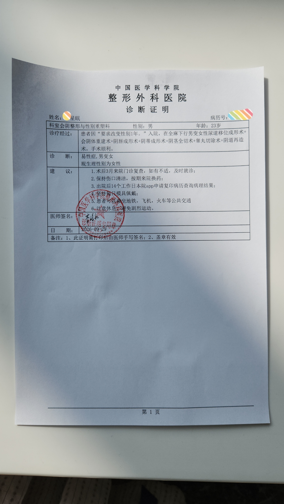



- 待床头卡上名字消失后，可以办理出院。
- 拿着诊断证明，去门诊进门左手边“门诊服务台”盖章。**切记不要忘了盖章。**
- 拿着入院时的押金收据、身份证和银行卡，去办理入院时的住院窗口处（门诊大厅进门扶梯旁右转），取号，办理退费与出院。这时你会得到一份很长的费用明细，**留着有用**。
- 回病房收拾东西，歇一会儿，走人。



> 是谁拿到诊断证明之后，爱不释手，对着上面的“现生理性别为女性”看了又看，摸了又摸，还偷偷亲了一口啊？\
> 不会是我自己的……对吧？


