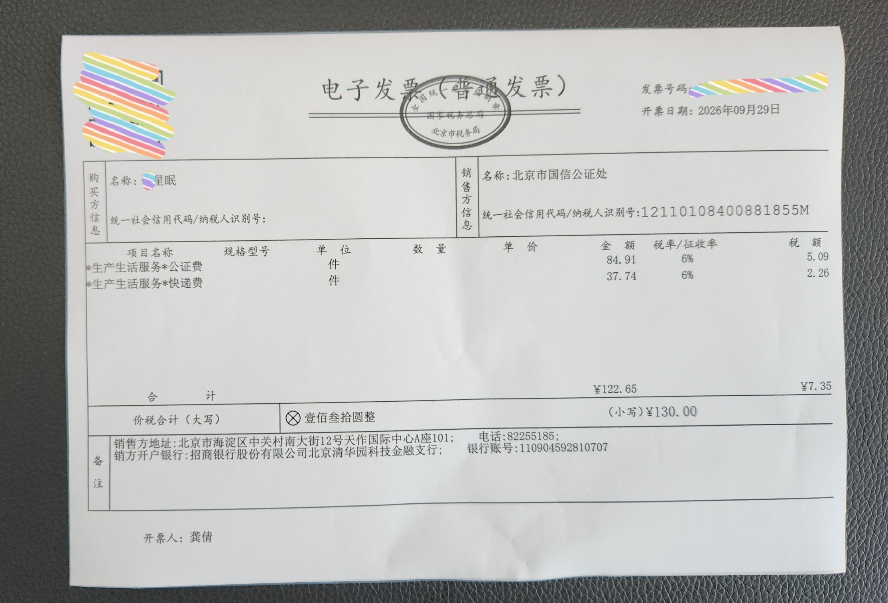
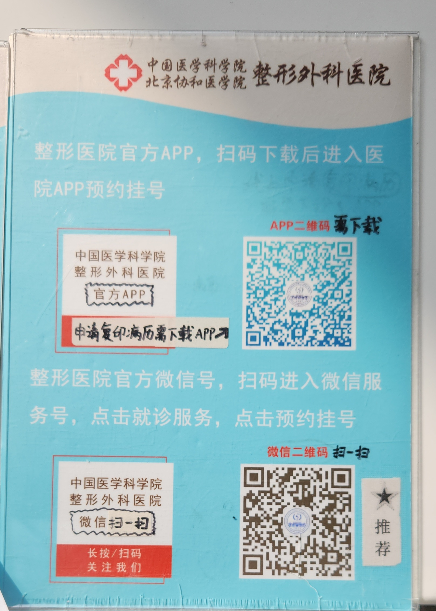
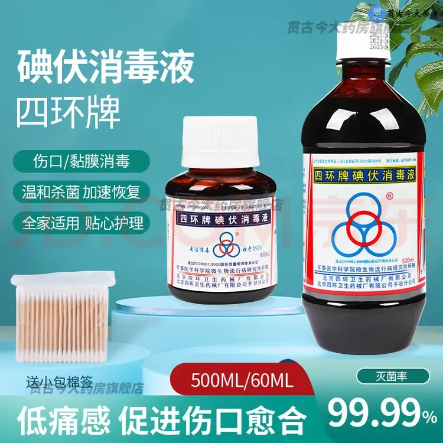
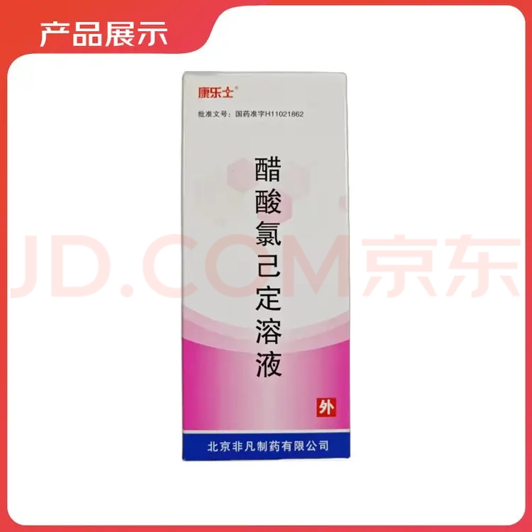
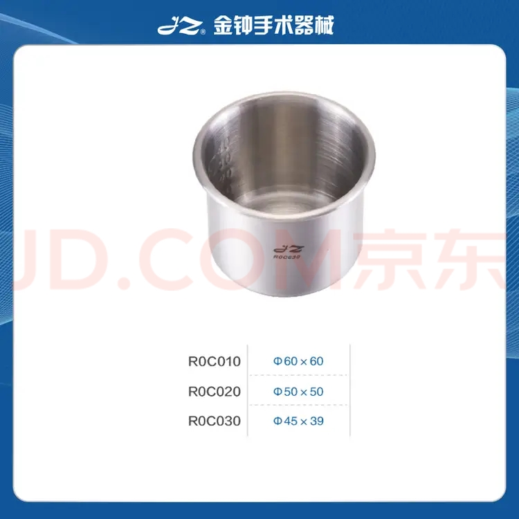
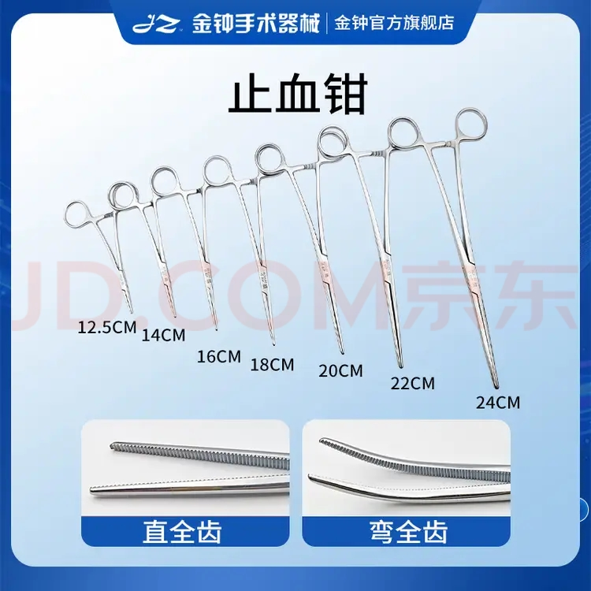
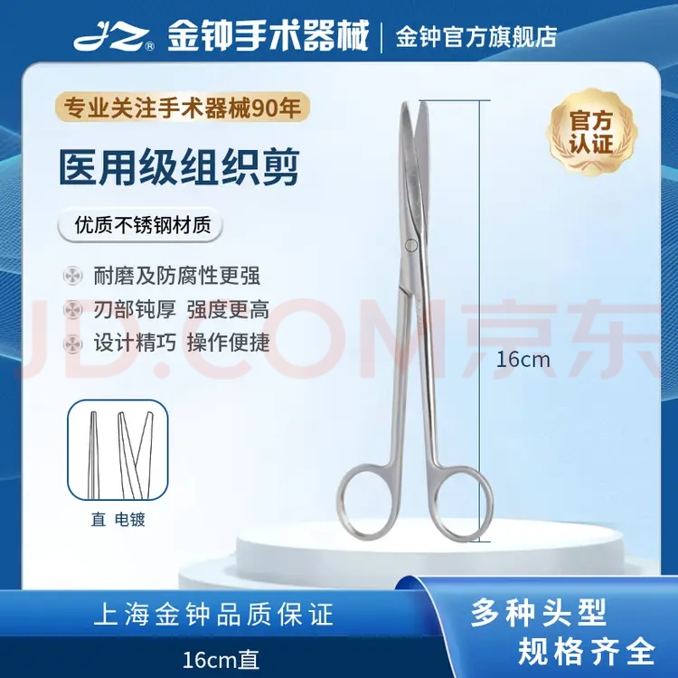
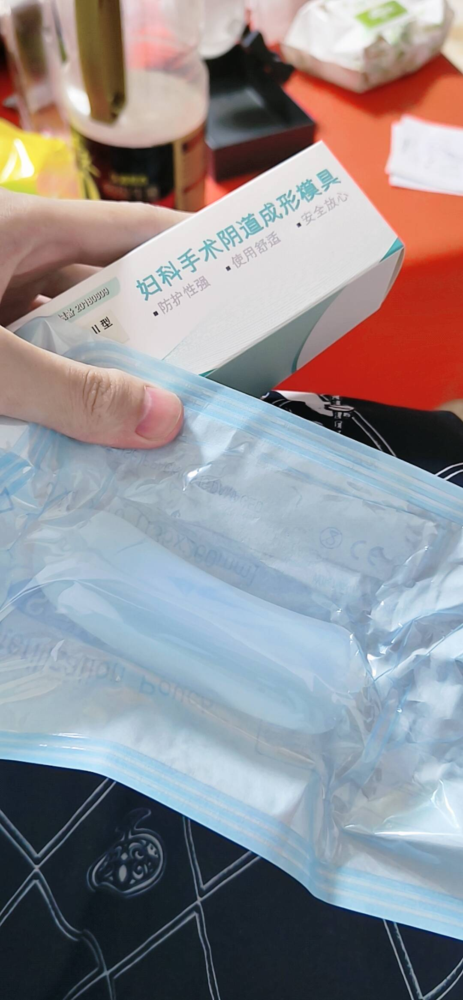


数据来自于单名接受手术者，会随实际情况而变动。



更多信息请参阅 **[医院给的宣教文件]()**。


## 公证出院诊断

出院诊断证明书可前往**北京市国信公证处**进行公证。\
地址：**北京市海淀区中关村南大街12号天作国际中心A座101**\
电话：**010-82255185 16600055185(同微信）**

所需材料：

1. 本人身份证
2. 出院诊断证明原件（盖章）
3. 辅助证明材料（住院病历。如无病历则**住院患者结账费用项目汇总表**亦可）

费用：

- 公证费（含1份公证书）：80元
- 另加公证书：10元/份
- 邮寄费：40元







**公证员业务熟练 ~~（会鉴跨)~~ ，全流程大约20分钟。不会收走诊断证明原件。**

## 复印病历

出院一周后，在整形外科医院官方APP申请病历打印并邮寄。\
如需等待病理结果，请在病理出结果后再行复印。通常病理于15个工作日左右出结果。





```txt
线上病历复印业务服务协议

尊敬的患者及家属：

您好！

        欢迎您使用中国医学科学院整形外科医院提供的线上病历复印服务！为更好地使用本服务，您应当阅读并遵守《中国医学科学院整形外科医院线上病历复印业务服务协议》的相关规定。请您务必审慎阅读、充分理解各条款内容，特别是免责条款，并选择办理或不办理。

一、协议的范围：本协议是您与中国医学科学院整形外科医院之间关于使用本服务所订立的协议。

二、使用规范：线上病历复印服务是由中国医学科学院整形外科医院提供，旨在减少患者及患者家属等待的时间，为患者开辟一条方便、快捷的绿色通道。本服务供您申请复印住院病历/门诊病历资料的使用，您需同意本协议的相关条款，提供相关身份证明材料后方可申请线上病历复印服务。

三、复印收费标准：按照北京市发改委《病历复印收费标准》按A4纸每张0.4元收费。实际费用需进行在线支付。

四、快递收费标准：北京市区：13元，外省市：20元左右（*注明：快递费用由北京顺丰速运有限公司直接收取，该费用仅供参考。具体顺丰快递派送范围请参见顺丰官方网站http://www.sf-express.com/）。实际费用需由患者或其家属指定的收件人支付（到付）。

五、现场自取：
请您在出院后7个工作日申请线上住院病历复印自取服务，在您的资料审核通过并付费完成后，系统中会生成自提码，请您凭自提码到窗口自取病历。
自取地点：中国医学科学院整形外科医院行政楼2层病案科
工作时间：正常工作日（周一至周五）上午 8:00 ~11:30，下午13:30-16:00
如您申请复印门诊病历：请您在门诊就诊后1个工作日申请线上门诊病历复印自取服务，在您的资料审核通过并付费完成后，系统中会生成自提码，请您凭自提码到窗口自取病历。
自取地点：中国医学科学院整形外科医院行政楼2层病案科
工作时间：正常工作日（周一至周五）上午 8:00 ~11:30，下午13:30-16:00

六、邮寄时限：
(1) 如您申请复印住院病历：请您在出院后7个工作日申请线上住院病历复印邮寄服务，若做过病理检查，复印病历请顺延申请时间。一般情况下病理报告在出院15个工作日后出结果（以实际出结果时间为准）。在您的资料审核通过并付费完成后，在3个工作日内由北京顺丰速运有限公司统一到医院揽收快递。（您具体收到时间以快递公司时间为准，请您考虑快递公司等时间因素）
(2) 您在线上病历复印申请过程中产生的任何疑问，可咨询电话：53968043和53968042

七、提供材料：
1. 申请人为患者本人的，需提供①患者身份证原件；②患者手持身份证正面照。
2. 申请人为患者代理人的，需提供①患者身份证原件；②代理人身份证原件；③代理人手持患者及代理人身份证正面照；④患者本人签名的授权委托书。
以下情况请到病案科窗口复印：
1. 死亡患者病历；
2. 保险机构、公检法部门；
3. 无法提供患者本人身份证原件，或者患者本人仅有户口本、护照、军官证等其他身份证明的；
4. 对已封存病历申请复印的患者及家属。

八、免责条款：请您理解并同意
1. 物流风险：应确保填写的收件地址、收件人姓名、手机号等收件信息正确、完整、规范。因填写错误导致快递延误或无法送达所产生的相关费用，您需自行承担一切相关责任及费用。请收件人保持手机通信畅通，以免耽误接收北京顺丰速运有限公司快件。
2. 在病历复印快递件由北京顺丰速运有限公司揽件后，邮寄过程中产生的一切问题由您和北京顺丰速运有限公司自行解决。
3. 身份证件上传：本人自愿申请病历复印，并且承诺上传的身份证为本人所有，信息真实、有效，不存在伪造、盗用他人身份证信息行为，否则产生法律责任由申请人负责，医院不负任务法律责任。
4. 根据中华人民共和国国务院令第701号《医疗纠纷预防和处理条例》第十六条规定：“复制病历资料时，应当有患者或者其近亲属在场” 如果您阅读本公告后线上申请复印病历，且同意不到达现场复印病历，则视同您放弃参与现场复印病历的权利，认可中国医学科学院整形外科医院单方完成病历复印并邮寄。

本协议未尽事宜，依据中国医学科学院整形外科医院病案复印制度办理。

我已认真阅读以上信息并同意申请使用线上病历复印业务，支付由此产生的相关费用并自主自愿承担可能出现的快件丢失、延迟及隐私泄露等风险。
```



## 交通

### 乘坐飞机

**建议携带甜甜圈坐垫。**

在航司小程序上申请“轮椅服务”。建议申请“上下机轮椅”，即**从航司值机柜台到飞机舱门口**，自行步行进入舱内。下机时，也会在舱门口有轮椅迎接，推至机场出口或接机口。

从机场大门到值机柜台之间的轮椅，需拨打机场电话另外申请。

值机时，柜台人员会检查诊断证明，以及诊断证明上面的乘机许可。


值机柜台人员问你做了什么手术的时候，你可以不说话，直接把诊断证明递给他。


### 乘坐火车

**建议携带甜甜圈坐垫。**

在12306 APP或小程序，申请特殊旅客服务。车站现场亦可申请。

## 通模

### 自备药物与器械

#### 1. 护理垫

成人护理垫，清理模具时垫在下面。网购即可。

#### 2. 避孕套

套在模具外面，最好是无色无味的。网购即可。

#### 3. 纱布敷料

垫在模具外面，防止血液、组织液~~与尿液~~污染衣物。\
尺寸20x30厘米，网购即可。

#### 4. 模具

**~~假牛子~~**

合适的型号多买几根。旧的变黄了就换新的。

#### 5. 医用棉球

网购即可，多准备点。

#### 6. 四环牌碘伏消毒液


必须是四环牌的！！！也必须是碘伏消毒液，不能是碘酒！！！




#### 7. 醋酸氯己定溶液（康乐士）

每盒两支，可网购。



#### 8. 小药杯（笔者推荐）

装碘伏和棉球的，45x39尺寸的就好。



#### 9. 止血钳（笔者推荐）

夹碘伏棉球的，16cm中弯钳（弯全齿）。



#### 9. 组织剪（笔者推荐）

修整~~假牛子~~模具形状，16cm直剪。



### 清理模具步骤

**如需更换新模具，请提前使用组织剪修整为合适长度与形状。**

1. 在床上铺好成人护理垫。垃圾桶放于附近。
2. 将5-6个棉球放入放入小药杯，倒入碘伏，使棉球被均匀浸透。与止血钳一同放置于手边备用。
3. 打开醋酸氯己定包装，放置于手边备用。
4. 打开新的棉垫，放置于手边备用。
5. 取出单只避孕套，连包装放置于手边备用。
6. 清理双手后，躺在护理垫上，解开塑身衣，撩起至腰部以上。
7. 打开旧棉垫，使其垫在会阴部之下。
8. 缓慢从体内取出模具，丢弃其上旧避孕套。
9. 拿出一支醋酸氯己定，缓慢插入阴道，送至阴道尽头。挤压球囊，冲洗阴道。**不松手**从阴道中拔出，**切记不可松手**。整理球囊形状后，再次重复该过程。通常挤压两次即可耗尽该支药物。
10. 拿出另一支醋酸氯已定，冲洗会阴部外面。
11. 用止血钳夹持碘伏棉球，擦拭两侧阴唇。使用多个棉球。将间沟扒开，仔细清洁。
12. 将避孕套开封，套在模具上。
13. 用止血钳夹持碘伏棉球，擦拭套有避孕套的模具。使用多个棉球，使避孕套外表浸润碘伏。
14. 缓慢将模具**完全**送入体内，底座与阴唇平齐。
15. 拿出新棉垫，对折垫在会阴部模具外。起身，穿好塑身衣，调整裆部至最紧。
16. 清理废物与器械。


待阴道内不出血后，即可使用纯净水/生理盐水/凉开水代替醋酸氯己定进行冲洗。可保留之前使用过的醋酸氯己定球囊，以便后续冲洗。



执行上述过程时，请保证模具取出全程（第8-14步）时长不超过15分钟。



切记冲洗球口在阴道内时，捏住释放液体后，不可在拔出前松手！！！


### 脱离模具程序

**此节内容，有部分信息来源于芙拉（笔者友人，另一位接受手术者）口述。**

- 前六个月24小时佩戴模具，每天大便后取出清洁。
- 六个月复诊后，每天取出模具一小时后放回。初期会有疼痛，过几天，一小时放回不疼后，每天取出两小时。
- 逐渐增加每天取出时间，直至24小时取出。

### 一种更好的模具

**此节内容，信息来源于芙拉（笔者友人，另一位接受手术者）口述。**



此模具**无底座**、**自带弯度**、**两端圆润**。\
是医用器械，佩戴更为舒适。\
价格位于千元左右。

模具[购买链接](https://t.co/AfGTrDUTnE)。**仅作为分享，这不构成医疗建议。**


这个模具材料稍硬，不建议术后初期使用。最开始还是用软的，过几个月可以用这种。


## 上厕所

上厕所时，如模具影响排便，可短暂抽出一部分或取出。


请保证模具取出时长不超过15分钟。



模具取出来越久，放回去时候越痛。


## 洗澡

医生原话：

> 术后至少八九天可以淋浴。\
> 先穿着紧身衣洗，上身脱到腰，先洗非会阴区。\
> 洗会阴区的时候模具可以拿出来，要在十五分钟内洗完会阴区，再把模具带上。


请保证模具取出时长不超过15分钟。


**~~笔者一直疼，就一直忍着没洗。~~**
