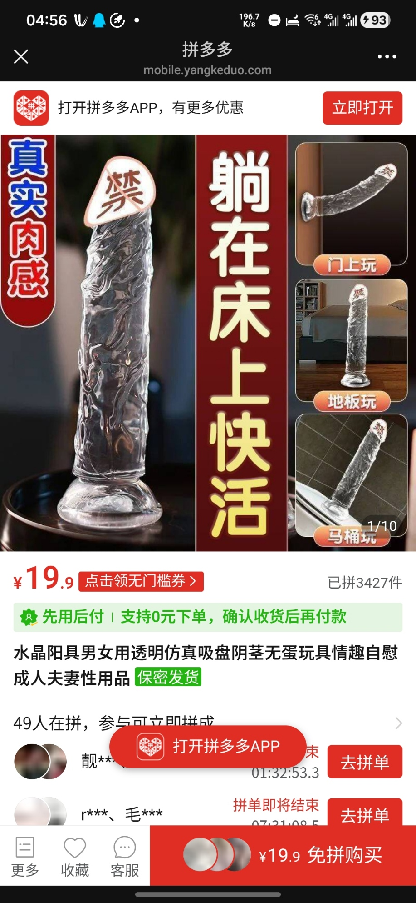
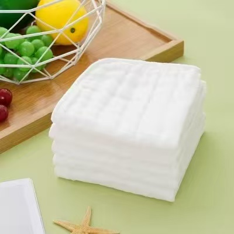
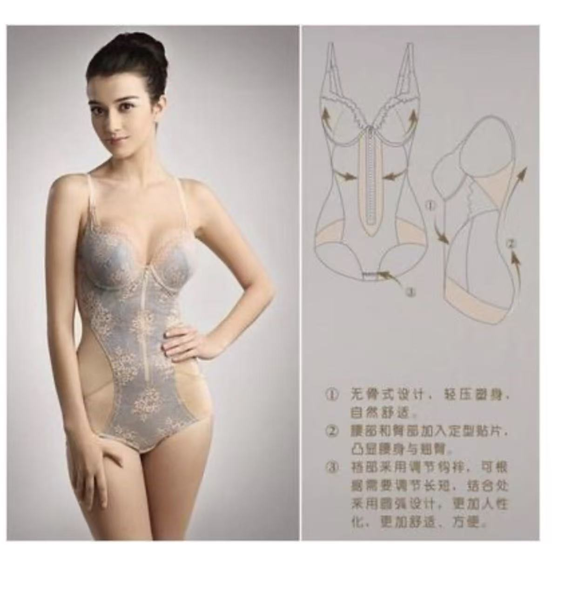


数据来自于[星眠子](https://x.com/hoshinemu123)（twitter: @hoshinemu123），可能会随实际情况变动。


## 物料准备

### 1.阴道模具

~~（假牛子）~~  

  

医院提供的模具购买[链接](https://mobile.yangkeduo.com/goods1.html?ps=RIqD5b8XtS)。  

买3.0厘米和3.5厘米，各买2-3个。术后会测试哪个直径更合适，出院后再多买一些。  

~~（术后可以躺在床上快活）~~  


如果不方便随身携带乘坐交通工具，可以将模具寄到医院丰巢快递柜。


### 2.避孕套

套在模具上通模用，多买一些，最好是无色无味的。  

### 3.白毛巾

  

医生让提前准备一些比较厚实的小白毛巾，20x20厘米。用于术后垫在模具外面，吸收血液，组织液~~以及尿液~~。  


换药室里的20x30纱布敷料比白毛巾好用得多。


### 4.塑身衣

  

用来术后兜住模具，把模具按在阴道里。  

医生并没有给出链接。  

准备两套，要试穿下看裆部是否有足够的力量支撑。  

（笔者的塑身衣不合格，被峰主任要求重买了。并在一天内造成了微弱的阴道萎缩。）  

> 抄作业链接：  
> [猫人夏天超薄款连体塑身内衣女士美体朔身收腹束腰塑形衣冰丝透气](https://e.tb.cn/h.8z42FEn6IJk7l2Z?tk=9b0tTpm9rcD)  
>
> 特别鸣谢：芙拉  

## 个人准备

1. 术前停激素一个月。
2. 精神科咨询围术期精神药品使用方案。
3. 避免感冒。
